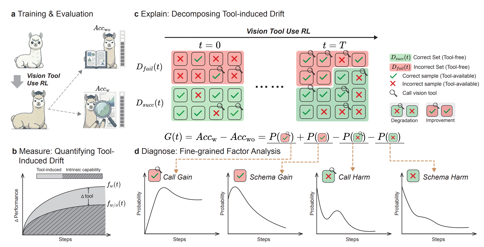
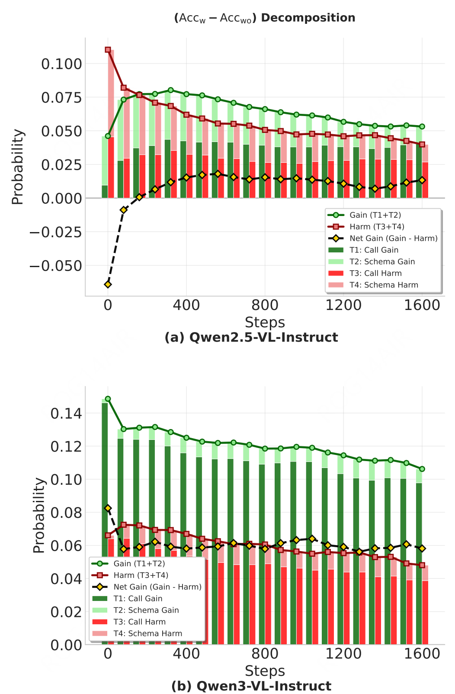
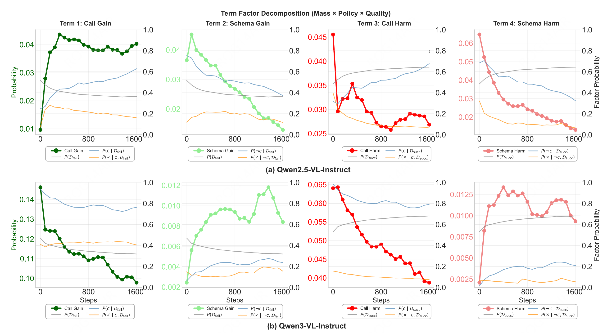

# What Does Vision Tool-Use Reinforcement Learning Really Learn? Disentangling Tool-Induced and Intrinsic Effects for Crop-and-Zoom

<p align="center">
  <a href="https://www.python.org/downloads/"></a>
  <a href="https://opensource.org/licenses/MIT"></a>
  <a href="https://arxiv.org/abs/2602.01334"></a>
  <a href="https://GAIR-NLP.github.io/Med/"></a>
  <a href="https://huggingface.co/datasets/Med2026/Med-eval-logs"></a>
  <a href="https://zhuanlan.zhihu.com/p/2005689547544093503"></a>
</p>

<p align="center">
  
</p>

## Overview

**TL;DR**: *Vision tool-use RL enhances model performance by reducing tool-induced harm, but does not significantly improve tool-based correction of intrinsic failures.*

This repository provides the **MED (Measure-Explain-Diagnose)** framework for analyzing vision tool-use reinforcement learning. We decompose performance improvements into **intrinsic capability changes** and **tool-induced effects**, providing fine-grained insights into what vision RL truly learns.

### Key Findings

- **Performance gains are primarily driven by intrinsic learning** - Models improve their base reasoning capabilities
- **Tool-use RL mainly reduces tool-induced harm** - Reduces errors from tool invocation and weakens tool pattern interference
- **Limited improvement in tool-based correction** - Tools don't significantly improve correction of intrinsic failures
- **Current vision RL learns to "safely coexist with tools"** - Rather than fully mastering their strategic use

## The MED Framework

The MED framework provides a **coarse-to-fine analysis** of vision tool-use reinforcement learning through three sequential steps:

<table>
<tr>
<td width="33%" align="center">
  <br>
  <b>Measure</b><br>
  Quantify tool-induced drift by decomposing<br>tool-available drift into intrinsic and tool-induced components
</td>
<td width="33%" align="center">
  <br>
  <b>Explain</b><br>
  Decompose tool-induced performance gap<br>into Gross Gain and Gross Harm via 4-term analysis
</td>
<td width="33%" align="center">
  <br>
  <b>Diagnose</b><br>
  Factorize each term into Mass, Policy, and Quality<br>to probe root causes of term evolution
</td>
</tr>
</table>

This repository contains the **core methodology** from our paper (Section 3), including:

- **4-term decomposition** - Call Gain, Schema Gain, Call Harm, Schema Harm
- **Factor analysis** - Decompose each term into Mass (domain size), Policy (when to call), Quality (how to use)
- **Visualization tools** - Generate all figures (Measure, Explain, Diagnose) from the paper

## Installation

```bash
# Install uv package manager (if not already installed)
curl -LsSf https://astral.sh/uv/install.sh | sh

# Clone the repository
git clone https://github.com/GAIR-NLP/Med.git
cd Med

# Create virtual environment and install dependencies
uv venv
source .venv/bin/activate  # On Windows: .venv\Scripts\activate
uv pip install -e .

# For training environment (includes torch, transformers, flash-attn, etc.)
uv pip install -e ".[train]"
```

**Requirements**: Python 3.11+, [uv](https://github.com/astral-sh/uv) package manager

## Training

### Training Data

The training dataset (~15k samples from 12 data sources) is available on HuggingFace:

```bash
hf download Med2026/Med_training_data --repo-type dataset --local-dir data/Med_training_data/
```

### Ray Cluster Setup

For distributed training, set up a Ray cluster. Here is an example for a 2-node cluster, each with 8 GPUs.

**Start the Head Node:** Run this command on your designated head node. The dashboard will be accessible at `http://<head_node_ip>:8265`.

```bash
ray start --head --dashboard-host=0.0.0.0
```

Note down the address provided (e.g., `xxxxxx:6379`).

**Start Worker Node(s):** Run this command on each worker node, replacing `xxxxxx:6379` with the address from the head node.

```bash
ray start --address=xxxxxx:6379
```

**Verify Cluster Status:** On the head node, run `ray status` to confirm that all nodes have joined and all GPUs (16 in this example) are detected.

### Reward Server

The reward server is a remote FastAPI service used to calculate reward values during training.

To start the reward server:

```bash
bash recipe/med/scripts/reward_server.sh
```

- `PORT`: Specifies the network port on which the reward server will listen for incoming requests.
- `WORKERS`: Sets the number of worker processes for the server.

Upon successful launch, a file named with a unique `JOB_ID` will be created in the `.reward_server/` directory. This file contains the IP address and port of the running server (e.g., `your_server_ip:8192`).

> **Note:** Take note of this `JOB_ID`, as it is required for configuring `REMOTE_REWARD_JOB_ID` in the training script.

### Launch Training

For a comprehensive list of all configurable parameters and hyperparameters, please refer to `recipe/med/scripts/train.sh`. Before running experiments, configure the following environment variables to match your setup.

**Set Base Directory and Python Path:** Point `BASE_DIR` to your cloned repository root so that all scripts can locate configs and modules correctly.

```bash
export BASE_DIR="/path/to/Med"
export PYTHONPATH=${BASE_DIR}/:${PYTHONPATH}
```

**Set Node and GPU Counts:** Adjust these values based on your actual cluster configuration (e.g., for 2 nodes with 8 GPUs each):

```bash
export NUM_NODES=2
export GPUS_PER_NODE=8
```

**Configure Reward Server Job ID:** Set `REMOTE_REWARD_JOB_ID` to the identifier(s) of your previously launched reward server(s). This enables the training pipeline to locate the reward server's address.

```bash
export REMOTE_REWARD_JOB_ID="j-xxxxxxxxxx"
```

**Set Training Data:**

```bash
export DATA_TRAIN_FILE="[/path/to/your/data/Med_training_data/train-00000-of-00030.parquet]"
```

**Model Loading and Checkpointing:** Configure paths for loading initial model weights and saving training states, along with the save frequency.

- `ACTOR_LOAD_PATH`: Path to the initial model checkpoint to load.
- `TRAIN_SAVE_FREQ`: Frequency to save the training state (e.g., `5` for every 5 steps, `-1` to disable saving).
- `TRAIN_SAVE_PATH`: Directory where training checkpoints will be stored.

```bash
export ACTOR_LOAD_PATH="/path/to/Qwen2.5-VL-7B-Instruct"
export TRAIN_SAVE_FREQ=10
export TRAIN_SAVE_PATH="/path/to/checkpoints"
```

**Set Wandb API Key:** Required for logging training metrics to [Weights & Biases](https://wandb.ai/).

```bash
export WANDB_API_KEY="your-wandb-api-key"
```

**Start Training:** First serve the vision tool, then launch the training script. The entry point `recipe/med/scripts/run.sh` handles this sequence automatically:

```bash
bash recipe/med/scripts/run.sh
```

This script will:
1. Verify Ray cluster status
2. Start the vision tool server (`recipe/med/scripts/serve_vision_tool.sh`)
3. Launch the training pipeline (`recipe/med/scripts/train.sh`)

## Reproducing Paper Figures

### Step 1: Download Evaluation Logs

Download the evaluation logs from HuggingFace:

```bash
# Using HuggingFace CLI
hf download Med2026/Med-eval-logs --repo-type dataset --local-dir evals/

# Or using Python API
from huggingface_hub import snapshot_download
snapshot_download(repo_id="Med2026/Med-eval-logs", repo_type="dataset", local_dir="evals/")
```

This downloads evaluation results for 6 perception benchmarks across 21 training checkpoints:
- VStar
- HRBench (4k)
- HRBench (8k)
- VisualProb (easy)
- VisualProb (medium)
- VisualProb (hard)

### Step 2: Generate CSV Data

Extract metrics from evaluation logs:

```bash
bash scripts/run_create_csv.sh
```

This creates CSV files in each eval logs with performance metrics, 4-term decomposition, and factor analysis across all checkpoints.

### Step 3: Generate Paper Figures

Generate all figures using the plotting script:

```bash
bash scripts/run_plot_paper_figures.sh
```

This generates two types of figures in the `figures/` directory:

**Aggregated figures** (averaged across all 6 benchmarks):
- `{exp_name}_measure.pdf` - MEASURE: Intrinsic vs tool-induced drift over training
- `{exp_name}_explain.pdf` - EXPLAIN: 4-term decomposition (Call/Schema Gain/Harm)
- `{exp_name}_diagnose.pdf` - DIAGNOSE: Factor analysis (Mass × Policy × Quality)

**Per-benchmark figures** (individual benchmark breakdowns):
- `{exp_name}_per_bench_exp{N}_measure.pdf` - MEASURE for each benchmark
- `{exp_name}_per_bench_exp{N}_explain.pdf` - EXPLAIN for each benchmark
- `{exp_name}_per_bench_exp{N}_diagnose.pdf` - DIAGNOSE for each benchmark

## Understanding the Results

The MED framework provides three levels of analysis, each visualized in separate figures:

### MEASURE: Quantifying Drift Components

<p align="center">
  
</p>

The MEASURE figure decomposes tool-available drift f<sub>w</sub>(t) into two components:

- **Grey area**: Intrinsic drift f<sub>wo</sub>(t) - performance change without tool access
- **Colored area**: Tool-induced drift Δ<sub>tool</sub>(t) - change in tool-induced performance gap
  - Green: positive relative gain (f<sub>w</sub> > f<sub>wo</sub>)
  - Red: negative relative drift (f<sub>wo</sub> > f<sub>w</sub>)
  - Color intensity: tool call rate

**Tool contribution ratio S<sub>tool</sub>** (top progress bar): fraction of total drift magnitude from tool effects

**Key finding**: Tool-induced effects account for only ~20-30% of total improvement. Most gains come from intrinsic capability improvements.

### EXPLAIN: 4-Term Decomposition

<p align="center">
  
</p>

The EXPLAIN figure decomposes the tool-induced performance gap G(t) = Acc<sub>w</sub>(t) - Acc<sub>wo</sub>(t) into:

**Gross Gain** (green, positive contributions):
- **Call Gain (Term 1)**: Intrinsic failures corrected by tool execution
- **Schema Gain (Term 2)**: Intrinsic failures recovered under tool schema without invocation

**Gross Harm** (red, negative contributions):
- **Call Harm (Term 3)**: Intrinsic successes lost due to tool calls
- **Schema Harm (Term 4)**: Intrinsic successes lost under tool schema without invocation

**Net gap G(t)** (yellow diamonds): Call Gain + Schema Gain - Call Harm - Schema Harm

**Key finding**: Gross Gain stagnates (Call Gain plateaus) while Gross Harm decreases consistently, indicating RL primarily reduces tool-induced harm rather than maximizing tool-based correction.

### DIAGNOSE: Factor Analysis

<p align="center">
  
</p>

The DIAGNOSE figure factorizes each of the four terms into:

- **Mass** (grey): Domain size P(D) - capacity for gain/harm
- **Policy** (blue): Calling probability P(call|D) - when to use the tool
- **Quality** (orange): Success rate P(✓|call,D) - how well the tool is used

**Thick line**: Term value (left axis)
**Thin lines**: Individual factors (right axis)

**Key findings**:
- **Limited failure correction**: Call Gain quality P(✓|call, failures) shows little improvement on current and persistent failure sets
- **Reduced breakage**: Call Harm quality P(✗|call, successes) decreases, indicating fewer errors on already-solved instances
- **Schema interference mitigation**: Schema Harm decreases as model becomes less sensitive to tool prompt

### Bottom Line

Current vision tool-use RL learns to **safely coexist** with tools rather than **master** them:
1. Tool effects contribute minimally (~20-30%) compared to intrinsic improvements
2. RL primarily reduces harm (fewer tool-induced errors) rather than increasing gain (better failure correction)
3. Models improve at not breaking existing capabilities, but show limited progress in using tools to fix hard cases

## Citation

If you find this work helpful, please cite our paper:

```bibtex
@article{ma2026does,
  title={What Does Vision Tool-Use Reinforcement Learning Really Learn? Disentangling Tool-Induced and Intrinsic Effects for Crop-and-Zoom},
  author={Ma, Yan and Zhang, Weiyu and Li, Tianle and Du, Linge and Shen, Xuyang and Liu, Pengfei},
  journal={arXiv preprint arXiv:2602.01334},
  year={2026}
}
```

## Roadmap

We are progressively open-sourcing components of the MED project:

- [x] **Evaluation logs** - Available at [HuggingFace](https://huggingface.co/datasets/Med2026/Med-eval-logs)
- [x] **Analysis code** - MED framework implementation (`recipe/med/analysis_plot/`)
- [x] **Training data** - Available at [HuggingFace](https://huggingface.co/datasets/Med2026/Med_training_data)
- [x] **Training code** - GRPO-based RL training pipeline (`recipe/med/`)
- [ ] **Evaluation data** - Benchmark datasets (6 perception tasks)
- [ ] **Evaluation code** - Evaluation pipeline for tool-free and tool-available protocols

Stay tuned for updates!

## License

This project is licensed under the MIT License - see the [LICENSE](LICENSE) file for details.
